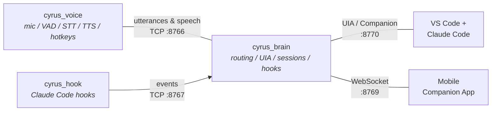
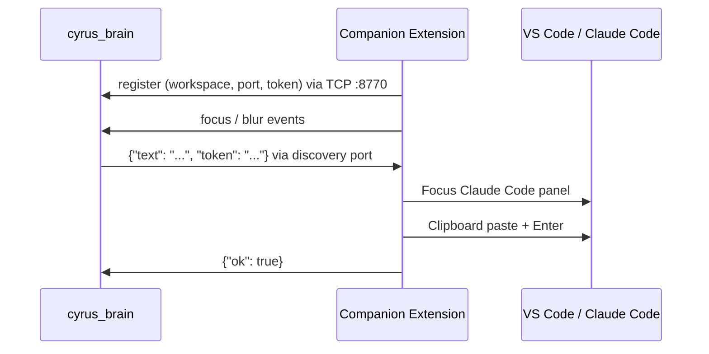

# Cyrus 2.0 — Voice Layer for Claude Code

Voice assistant for Claude Code in VS Code. Speak naturally, Cyrus transcribes
and routes your words to Claude Code, then reads the response aloud.

## Architecture



**Brain** — routing, session management, VS Code integration via UIA or companion extension.
Runs on the dev machine (Windows) or headless in Docker.

**Voice** — microphone capture, Silero VAD, Whisper STT, Kokoro/Edge TTS.
Runs locally or on a remote GPU machine. Loads models once at startup.

## Quick Start (Split Mode)

```bash
# 1. Configure
cp .env.example .env
# Edit .env — at minimum set CYRUS_AUTH_TOKEN

# 2. Install dependencies
pip install -r requirements-brain.txt      # brain + voice on same machine
# OR separately:
pip install -r requirements.txt            # brain only
pip install -r requirements-voice.txt      # voice only

# 3. Run
# Terminal 1 — Brain (dev machine with VS Code)
python cyrus_brain.py

# Terminal 2 — Voice (same machine or remote)
python cyrus_voice.py --host <brain-ip>    # defaults to localhost
```

## Project Structure

```
cyrus_brain.py              Brain service — routing, UIA, hooks (PRIMARY ENTRY POINT)
cyrus_voice.py              Voice service — mic, VAD, Whisper, TTS
cyrus_common.py             Shared types, constants, session management, text processing
cyrus_config.py             Configuration loader (env vars with defaults)
cyrus_hook.py               Claude Code hook script (Stop/PreToolUse/PostToolUse/Notification/PreCompact)
cyrus_server.py             Remote brain — stateless WebSocket server for mobile-only setups
cyrus_log.py                Logging setup
main.py                     DEPRECATED monolith wrapper (delegates to cyrus_brain)
probe_uia.py                UIA diagnostic tool

.env.example                Full environment variable reference (23 variables)
Dockerfile                  Headless brain image (Python 3.12-slim)
docker-compose.yml          Multi-port orchestration

requirements.txt            Brain dependencies
requirements-voice.txt      Voice dependencies
requirements-brain.txt      Brain + Voice combined
requirements-brain-headless.txt  Minimal headless brain (no GUI/audio/ML)
requirements-dev.txt        pytest, ruff

tests/                      27+ test files (pytest + pytest-asyncio)
```

## Features

### Brain

- **Fast commands** — regex-dispatched meta-commands (no LLM round-trip)
- **Session management** — track multiple Claude Code projects, aliases, persistence
- **VS Code integration** — UIA-based chat input + permission dialog handling (Windows)
- **Companion extension** — alternative text submission without UIA (port 8770)
- **Hook listener** — receives Claude Code events on port 8767
- **Mobile broadcast** — streams events to mobile companion via WebSocket (port 8769)
- **Health check** — `GET /health` on port 8771 for Docker/k8s probes

### Voice

- **Silero VAD** — real-time voice activity detection with configurable thresholds
- **Whisper STT** — faster-whisper with models from tiny.en to medium.en
- **TTS** — Kokoro ONNX (local, fast) with Edge TTS fallback
- **Wake-word filtering** — recognizes "Cyrus" and phonetic variants
- **Hotkeys** — F7 (stop speech), F8 (read clipboard), F9 (pause/resume)

## Voice Commands

| Command | Examples |
|---|---|
| **Pause/resume** | `pause`, `pause for 10 seconds`, `stop listening` |
| **Unlock** | `unlock`, `unlock <password>`, `auto`, `follow focus` |
| **Which project** | `which project`, `what session` |
| **Replay** | `last message`, `repeat`, `replay`, `again` |
| **Switch project** | `switch to <name>`, `use <name>`, `open <name>` |
| **Rename** | `rename to <name>`, `call this <name>` |

## Configuration

All settings have sensible defaults. Override via `.env` file or shell exports.
See [`.env.example`](.env.example) for the full reference (23 variables).

Key variables:

| Variable | Default | Description |
|---|---|---|
| `CYRUS_AUTH_TOKEN` | *(random)* | Shared secret for all TCP connections |
| `CYRUS_BRAIN_PORT` | `8766` | Brain TCP server |
| `CYRUS_HOOK_PORT` | `8767` | Hook event channel |
| `CYRUS_WHISPER_MODEL` | `medium.en` | Whisper model size |
| `CYRUS_SPEECH_THRESHOLD` | `0.6` | VAD sensitivity (0.0–1.0) |
| `CYRUS_SILENCE_WINDOW` | `1500` | ms of silence to end utterance |
| `CYRUS_HEADLESS` | *(unset)* | Set to `1` for headless/Docker mode |
| `CYRUS_STATE_FILE` | `~/.cyrus/state.json` | Session state persistence path |

## Hook Setup

Install `cyrus_hook.py` in `~/.claude/settings.json`:

```json
{
  "hooks": {
    "Stop": [{ "type": "command", "command": "python /path/to/cyrus_hook.py" }],
    "PreToolUse": [{ "type": "command", "command": "python /path/to/cyrus_hook.py" }],
    "PostToolUse": [{ "type": "command", "command": "python /path/to/cyrus_hook.py" }],
    "Notification": [{ "type": "command", "command": "python /path/to/cyrus_hook.py" }],
    "PreCompact": [{ "type": "command", "command": "python /path/to/cyrus_hook.py" }]
  }
}
```

The hook reads JSON from stdin, forwards relevant payloads to the brain on port 8767.
It never raises — a crashing hook would block Claude Code.

## VS Code Companion Extension

The companion extension lets the brain submit text to Claude Code without
UIA screen automation. Required for headless/Docker deployments, optional
otherwise (brain falls back to UIA on Windows).

Source: [`../cyrus-companion/`](../cyrus-companion/)

### How It Works



### Build & Install

```bash
cd cyrus-companion
npm install
npm run compile
npx @vscode/vsce package        # creates cyrus-companion-0.1.0.vsix

# Install into VS Code (pick one):
code --install-extension cyrus-companion-0.1.0.vsix
# OR: VS Code → Extensions → ⋯ → Install from VSIX
```

### VS Code Settings

| Setting | Default | Description |
|---|---|---|
| `cyrusCompanion.brainHost` | `localhost` | Brain hostname/IP |
| `cyrusCompanion.brainPort` | `8770` | Brain registration port |
| `cyrusCompanion.focusCommand` | *(auto-detect)* | VS Code command to focus Claude Code input |

Auto-detect tries these commands in order: `claude-vscode.focus`,
`claude-vscode.sidebar.open`, `workbench.view.extension.claude-sidebar`.

### Platform Details

| Platform | Transport | Discovery |
|---|---|---|
| **Windows** | TCP `127.0.0.1:{8768–8778}` | `%LOCALAPPDATA%\cyrus\companion-{workspace}.port` |
| **Linux / macOS** | Unix socket | `/tmp/cyrus-companion-{workspace}.sock` |

The extension binds the first free port (Windows) or socket, then registers
with the brain on port 8770. The brain reads the discovery file/socket path
when it needs to submit text.

### Keyboard Simulation

Enter key and permission dialog responses use platform-native methods:

| Platform | Method |
|---|---|
| Windows | PowerShell `WScript.Shell.SendKeys` |
| macOS | `osascript` (System Events) |
| Linux | `xdotool` |

## Deployment

### Local split-mode

Brain + voice on the same machine. Simplest setup.

### Remote split-mode

Brain on Windows dev machine, voice on a remote GPU machine.
Set `--host <brain-ip>` when starting `cyrus_voice.py`.

### Docker (headless brain)

```bash
cp .env.example .env
# Set CYRUS_AUTH_TOKEN in .env
docker compose up -d
docker compose logs -f
```

Runs brain in headless mode (`CYRUS_HEADLESS=1`). No GUI, audio, or ML models.
Requires the companion extension or a remote voice service.

Ports exposed: 8766 (brain), 8767 (hooks), 8769 (mobile), 8770 (companion).

### Mobile-only

Run `cyrus_server.py` (port 8765) as a stateless WebSocket server.
Mobile clients send utterances and receive routing decisions directly.

## Testing

```bash
pip install -r requirements-dev.txt
pytest tests/
pytest tests/ -v --cov=.
```

## Security

- All TCP/WebSocket connections require `CYRUS_AUTH_TOKEN`
- Token validated via HMAC constant-time comparison
- If `CYRUS_AUTH_TOKEN` is unset, a random token is generated at startup (printed to stderr) — effectively blocking all external clients
- Generate a token: `python -c "import secrets; print(secrets.token_hex(16))"`

## Deprecated: Monolith Mode

> **`main.py` is deprecated and will be removed in Cyrus 3.0.**

The original `main.py` combined voice I/O and brain logic in a single process.
It now delegates to `cyrus_brain.py` and prints a deprecation warning on startup.

**Use split mode instead.** If you previously ran `python main.py`, switch to:

```bash
python cyrus_brain.py &
python cyrus_voice.py
```

No configuration changes needed — split mode uses the same `.env` and hooks.
