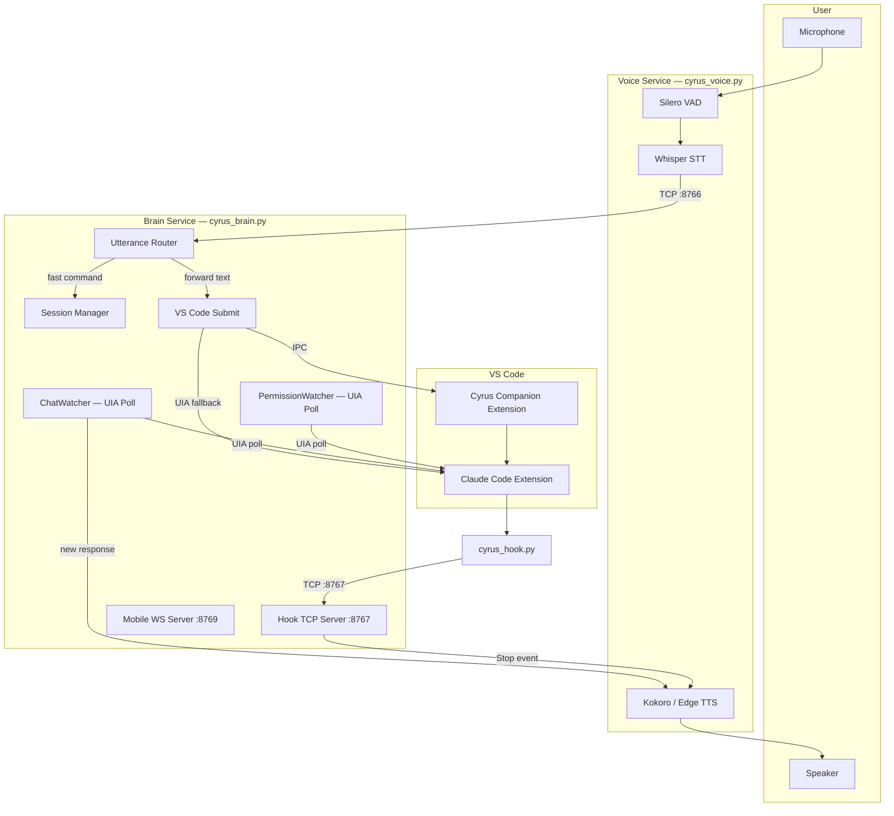

# 01 — Architecture Overview

Cyrus is a voice assistant layer for Claude Code in VS Code. You speak into your microphone, Cyrus transcribes and routes your words to the correct Claude Code session, and reads Claude's response aloud.

## Two Deployment Modes

| Mode | Files | Use case |
|------|-------|----------|
| **Split services** | `cyrus_voice.py` + `cyrus_brain.py` | Recommended. Restart brain without reloading Whisper. Can run voice on a separate machine. |
| **Monolith** | `main.py` | Everything in one process. Simpler but can't restart brain independently. |

Both modes share identical routing logic, session management, and UI automation code.

## High-Level Architecture

## Key Services

| File | Role | Runs Where |
|------|------|------------|
| `cyrus_voice.py` | Audio I/O: mic capture, Whisper STT, Silero VAD, Kokoro/Edge TTS | Any machine with mic/speaker |
| `cyrus_brain.py` | Logic: routing, sessions, UIA automation, hooks, mobile WS | Dev machine with VS Code |
| `cyrus_hook.py` | Claude Code hook script. Fires per-event, sends JSON to brain on TCP :8767 | Called by Claude Code |
| `cyrus-companion/` | VS Code extension. Receives text from brain via IPC, pastes into chat, presses Enter | Inside VS Code |
| `cyrus_server.py` | Optional remote brain. Stateless WebSocket routing server | Any machine |
| `main.py` | Monolith: voice + brain combined in one process | Single machine |
| `probe_uia.py` | Diagnostic: walks VS Code UIA tree for chat webview debugging | Manual use |
| `test_permission_scan.py` | Diagnostic: polls UIA tree for permission dialog detection | Manual use |

## Tech Stack

| Layer | Technology |
|-------|-----------|
| Speech-to-text | [faster-whisper](https://github.com/SYSTRAN/faster-whisper) `medium.en`, CUDA or CPU |
| Voice activity detection | [Silero VAD](https://github.com/snakers4/silero-vad) (PyTorch) |
| Text-to-speech (primary) | [Kokoro ONNX](https://github.com/hexgrad/kokoro) — local, GPU-capable |
| Text-to-speech (fallback) | [Edge TTS](https://github.com/rany2/edge-tts) — cloud, needs ffmpeg |
| UI automation | [uiautomation](https://github.com/yinkaisheng/Python-UIAutomation-for-Windows) + [pyautogui](https://pyautogui.readthedocs.io/) |
| Audio I/O | [sounddevice](https://python-sounddevice.readthedocs.io/) (PortAudio), [pygame](https://www.pygame.org/) (chimes) |
| Hotkeys | [keyboard](https://github.com/boppreh/keyboard) — F7, F8, F9 |
| Networking | asyncio TCP (voice-brain), TCP (hooks), WebSocket (mobile, remote brain) |
| VS Code extension | TypeScript, zero npm runtime dependencies |

## Key Design Decisions

1. **Wake word required.** Cyrus ignores all speech unless it starts with "Cyrus" (or a phonetic variant like "sire", "sirius", etc.). Prevents accidental submissions.
2. **Mic muted during TTS.** Prevents echo/feedback loops. Only a wake word can interrupt playback.
3. **UIA polling, not events.** VS Code's Electron/Chrome webview doesn't fire reliable UIA events. ChatWatcher polls at 0.5s, PermissionWatcher at 0.3s.
4. **Companion extension preferred for submit.** Brain tries the Companion extension first (reliable, cross-platform IPC). Falls back to UIA click+paste if unavailable.
5. **Dedicated COM submit thread.** All UIA writes to VS Code run on a single `CoInitializeEx()` thread to avoid cross-apartment COM errors on Windows.
6. **Hook script never blocks.** `cyrus_hook.py` always exits 0, even if the brain is down. A crashing hook would block Claude Code.
