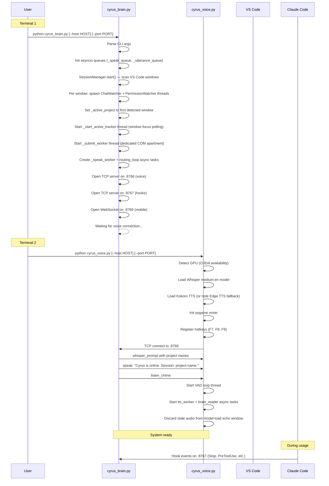
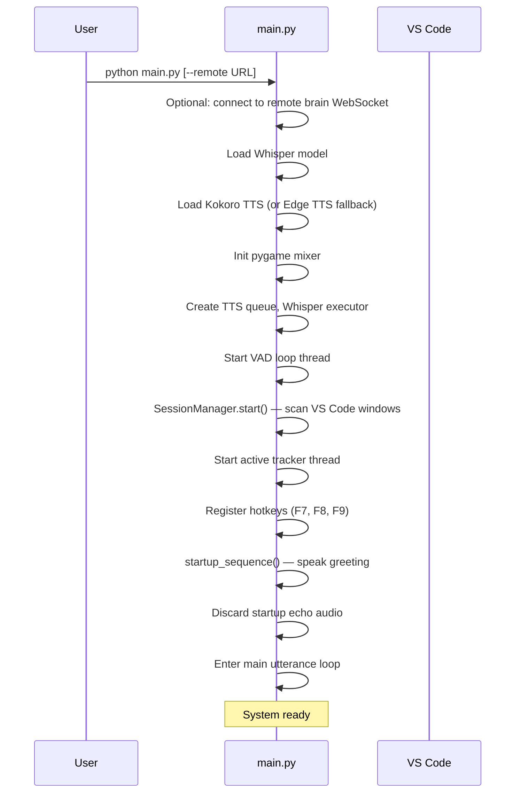
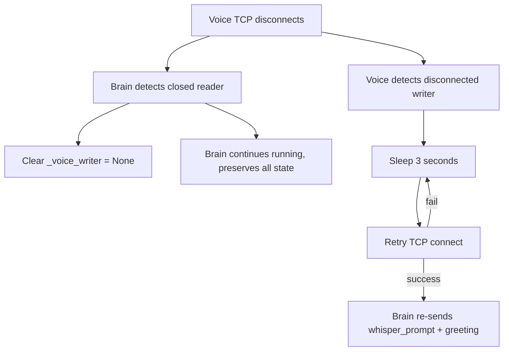

# 02 — Startup and Lifecycle

## Split Services Boot Sequence

## Monolith Boot Sequence (main.py)

## CLI Arguments

### cyrus_brain.py

| Arg | Default | Description |
|-----|---------|-------------|
| `--host` | `0.0.0.0` | Listen interface |
| `--port` | `8766` | Voice TCP port |

### cyrus_voice.py

| Arg | Default | Description |
|-----|---------|-------------|
| `--host` | `localhost` | Brain host to connect to |
| `--port` | `8766` | Brain port to connect to |

### main.py

| Arg | Default | Description |
|-----|---------|-------------|
| `--remote` | (none) | WebSocket URL of remote brain, e.g. `ws://192.168.1.10:8765` |

## Port Map

| Port | Protocol | From | To | Purpose |
|------|----------|------|----|---------|
| 8766 | TCP | Voice | Brain | Utterances + TTS commands (bidirectional) |
| 8767 | TCP | Hook script | Brain | Claude Code lifecycle events (one-shot) |
| 8768-8778 | TCP (Windows) | Brain | Companion Ext | Submit text to chat panel |
| Unix socket | AF_UNIX (Linux/Mac) | Brain | Companion Ext | Submit text to chat panel |
| 8769 | WebSocket | Mobile clients | Brain | Remote voice control |
| 8765 | WebSocket | main.py | cyrus_server.py | Optional remote brain routing |

## Shutdown

### Voice service (cyrus_voice.py)

On Ctrl+C or disconnect:
1. Set `_shutdown` event -- VAD loop exits
2. Set `_stop_speech` -- abort TTS playback
3. Set `_mic_muted` -- stop VAD processing
4. Stop pygame mixer
5. Stop sounddevice streams
6. Shutdown Whisper executor
7. Unhook all keyboard listeners
8. `os._exit(0)` -- force-exit to avoid PortAudio/SDL destructor crashes

### Brain service (cyrus_brain.py)

On Ctrl+C: asyncio servers close, daemon threads die automatically.

### Monolith (main.py)

Same shutdown as voice service, since it owns the audio hardware.

## Reconnection

The brain can be restarted freely during development. The voice service stays warm (Whisper model loaded) and reconnects automatically.
