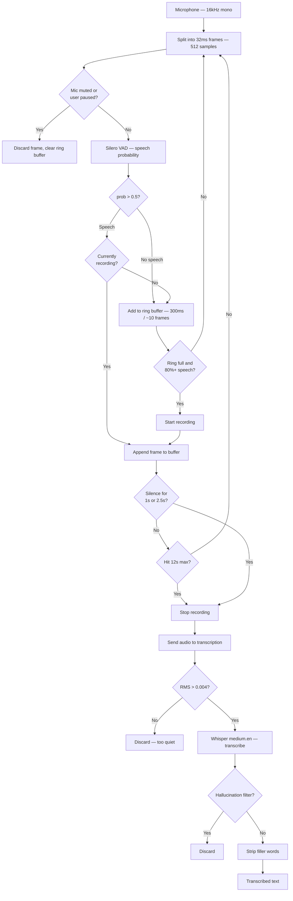
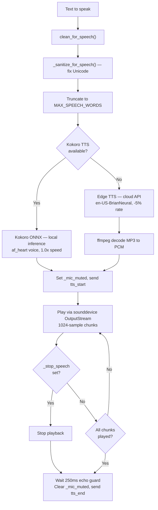
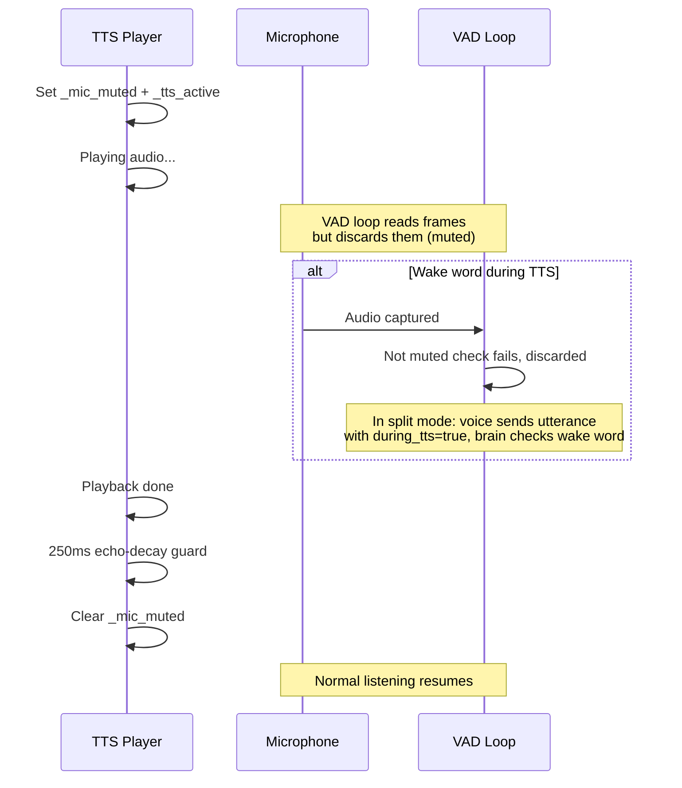

# 03 — Voice Pipeline

How speech goes from your microphone to text, and how text becomes speech.

## Speech-to-Text Flow

### Key Concepts

**Ring buffer.** A fixed-size circular buffer (`deque(maxlen=SPEECH_RING)`) holds the last ~300ms of audio. When VAD detects sustained speech, the ring contents become the start of the recording. This captures the beginning of an utterance that triggered detection.

**Adaptive silence window.** Short commands get 1s silence window. If speech exceeds 1.5s of voiced frames, the silence window doubles to ~2.5s. This allows natural pauses in longer utterances.

**Whisper initial prompt.** Whisper's `initial_prompt` parameter is seeded with project names (e.g., "Cyrus, switch to web-app cyrus."). This biases recognition toward expected vocabulary.

**Hallucination filter.** Whisper sometimes hallucinates YouTube-style phrases on silence ("thanks for watching", "subscribe"). A regex filter catches and discards these.

**Filler stripping.** Leading filler words (uh, um, okay, so, hey, please, can you, etc.) are stripped iteratively before forwarding to Claude.

## VAD Configuration Constants

| Constant | Value | Meaning |
|----------|-------|---------|
| `SAMPLE_RATE` | 16000 | Hz, required by Silero VAD |
| `FRAME_SIZE` | 512 | Samples per frame (32ms at 16kHz) |
| `SPEECH_THRESHOLD` | 0.5 | VAD probability threshold |
| `SPEECH_WINDOW_MS` | 300 | Ring buffer duration |
| `SPEECH_RATIO` | 0.80 | Fraction of ring that must be speech to trigger |
| `SILENCE_WINDOW_MS` | 1000 | Silence duration to end recording |
| `MAX_RECORD_MS` | 12000 | Hard cap on recording duration |
| `_MIN_RMS` | 0.004 | ~-48 dBFS energy floor |

## Text-to-Speech Flow

### Response Cleaning Pipeline (`clean_for_speech`)

Applied before TTS to make Claude's markdown-heavy responses speakable:

1. Replace code blocks with "See the chat for the code."
2. Strip inline backticks, headers, bold/italic markers
3. Convert markdown links to just their text
4. Replace bullets and numbered lists with periods
5. Collapse whitespace
6. Sanitize Unicode (em dash to comma, curly quotes to straight, etc.)
7. Truncate to word limit (30 in monolith, 50 in brain) with "See the chat for the full response."

### TTS Engines

| Engine | Latency | Requires | Quality |
|--------|---------|----------|---------|
| **Kokoro ONNX** | ~80-150ms on GPU | `kokoro-v1.0.onnx` + `voices-v1.0.bin` in project dir | High, natural |
| **Edge TTS** | ~500-2000ms | Internet + ffmpeg on PATH | Good, Microsoft voices |

Kokoro is preferred. If model files are missing or load fails, Edge TTS is used automatically.

## Echo Prevention

In the **split architecture**, the voice service tags utterances with `during_tts: true`. The brain only processes these if they contain a wake word, then sends `stop_speech` to interrupt playback.

In the **monolith**, the main loop checks `_tts_active` / `_tts_pending` directly and only processes wake-word utterances during TTS.

## Hotkeys

| Key | Action | Implementation |
|-----|--------|----------------|
| **F9** | Toggle pause/resume listening | Sets/clears `_user_paused` threading.Event |
| **F7** | Stop current TTS + clear queue | Sets `_stop_speech`, drains TTS queue |
| **F8** | Read clipboard contents aloud | Reads pyperclip.paste(), enqueues for TTS |
