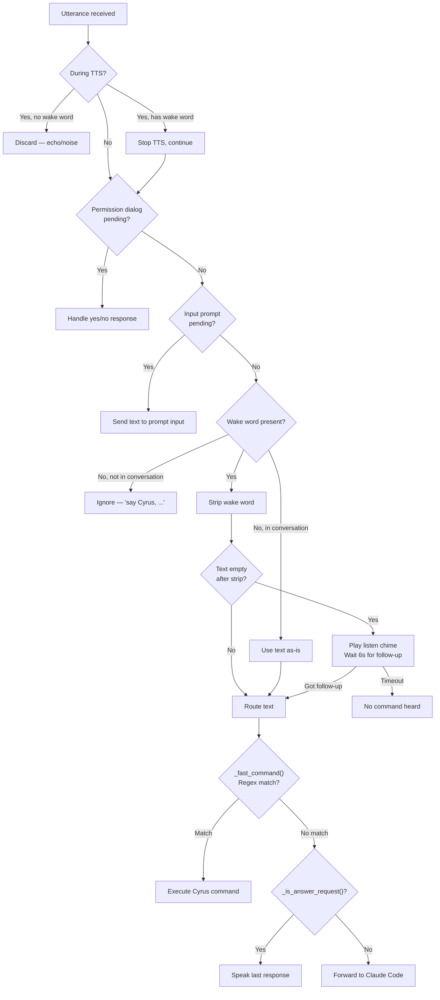
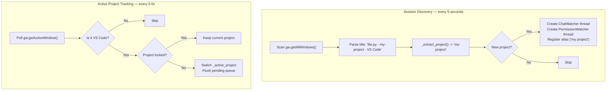
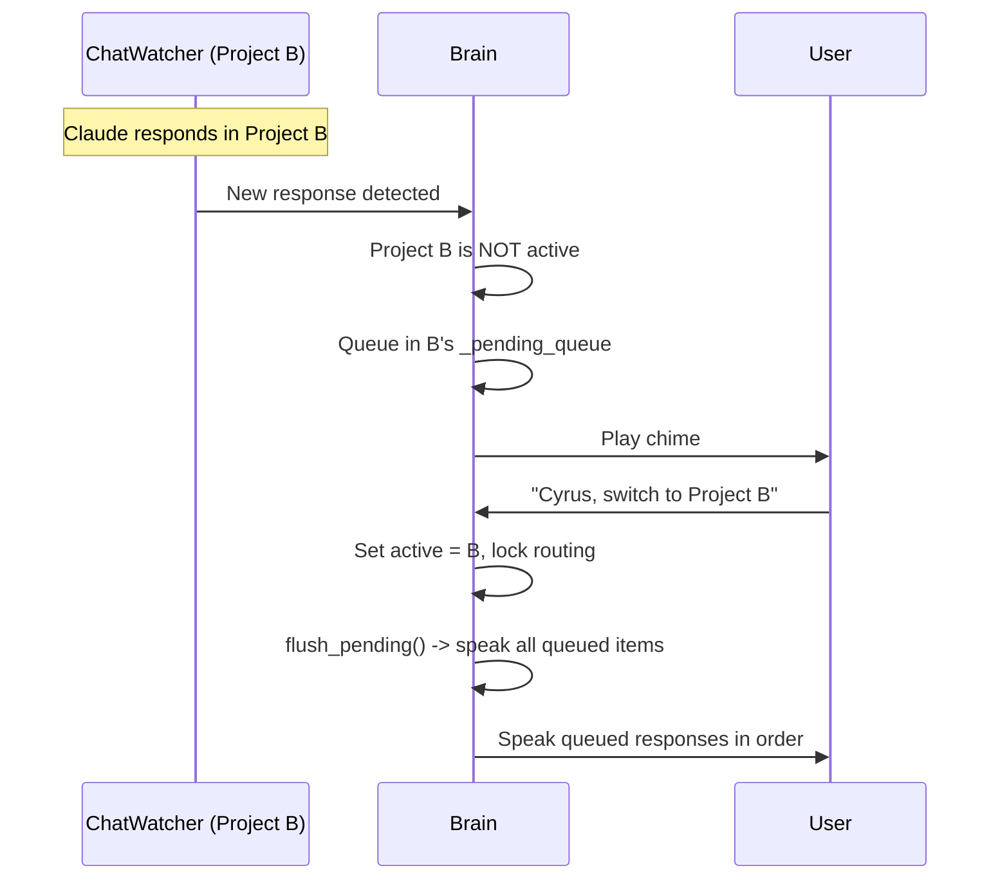
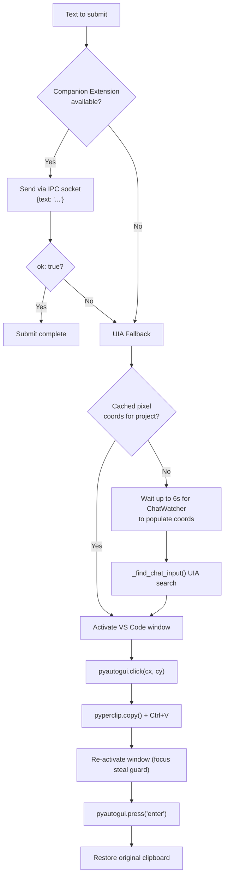

# 04 — Brain and Routing

The brain decides what to do with each utterance and manages VS Code automation.

## Utterance Routing Flow

## Fast Commands (Regex)

These are handled locally with zero latency — no LLM or network call needed.

| Pattern | Command Type | Action |
|---------|-------------|--------|
| `pause`, `resume`, `stop listening` | `pause` | Toggle `_user_paused` (split) or send pause to voice (split) |
| `unlock`, `auto`, `follow focus` | `unlock` | Clear `_project_locked`, follow window focus |
| `which project`, `what session` | `which_project` | Speak active project name + lock status |
| `switch to X`, `go to X`, `use X`, `open X` | `switch_project` | Set active project, lock routing |
| `last message`, `repeat`, `replay` | `last_message` | Re-speak last response for active project |
| `rename this to X`, `call this X` | `rename_session` | Update session alias |
| `rename X to Y` | `rename_session` | Update specific session alias |

## Answer Request Detection

The `_ANSWER_RE` regex catches phrases like:
- "recap", "summarize", "summary"
- "what did Claude say", "what was the response"
- "last response", "last reply"
- "repeat that", "repeat what you said"

When matched, the last spoken response is replayed (truncated to 30 words with "See the chat for more.").

## Multi-Session Management

### Session Aliases

Project names like `my-web-app` get aliases like `my web app` (dashes/underscores replaced with spaces). The `_resolve_project()` function matches queries against aliases using exact match first, then substring match (longest alias wins).

### Pending Response Queue

## ChatWatcher

Each VS Code session gets a dedicated `ChatWatcher` running on a daemon thread.

**How it finds the chat panel:**
1. Find VS Code window by `SubName`
2. Find `Chrome_RenderWidgetHostHWND` pane (depth 12)
3. Collect all `DocumentControl` nodes inside it
4. Prefer unnamed documents (the chat webview), else pick the deepest

**How it extracts responses:**
1. Walk the UIA tree (depth 12) collecting `(depth, controlType, name)` tuples
2. Find `"Message input"` EditControl as end anchor
3. Find last `"Thinking"` ButtonControl before it (start of Claude's response)
4. Fallback: last `"Message actions"` ButtonControl
5. Collect TextControl/ListItemControl text between start and end, deduplicating

**Stability check:** Response must be unchanged for 1.2s (`STABLE_SECS`) before speaking. This prevents reading partial streaming responses.

**New submission detection:** Counts `"Message actions"` buttons. An increase means the user submitted a new message, so `_last_spoken` is cleared to allow speaking the same text again.

## Submit Pipeline

In the **split architecture**, the submit runs on a dedicated thread (`_submit_worker`) with its own `comtypes.CoInitializeEx()` call. Requests are dispatched via `_submit_request_queue` with a threading.Event for synchronization.

## Whisper Prompt Management

As sessions are discovered, the brain builds a prompt string like `"Cyrus, switch to web-app cyrus."` and sends it to the voice service. This helps Whisper correctly recognize short project names.
