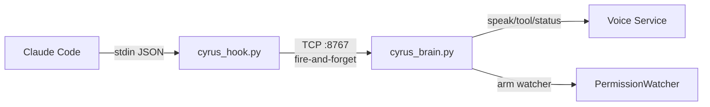
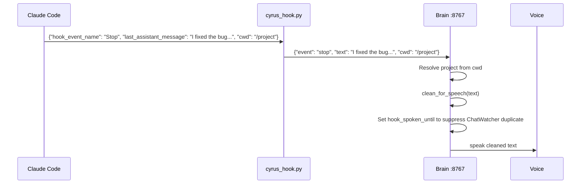
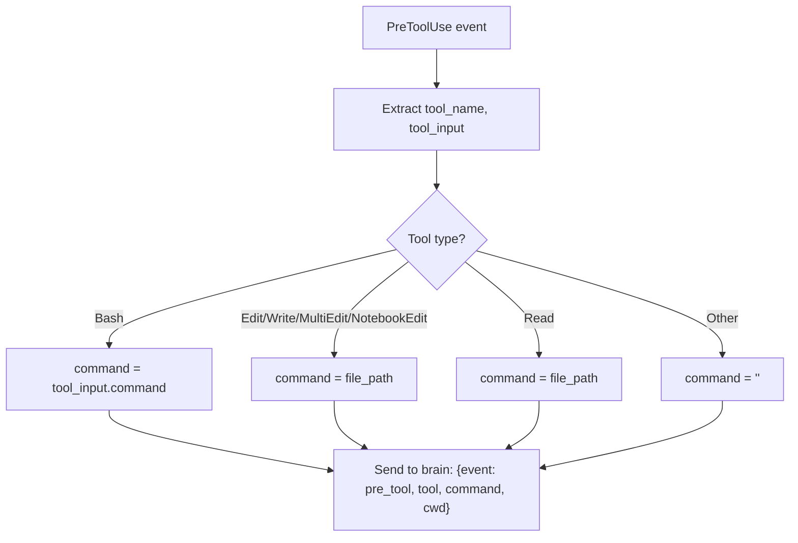
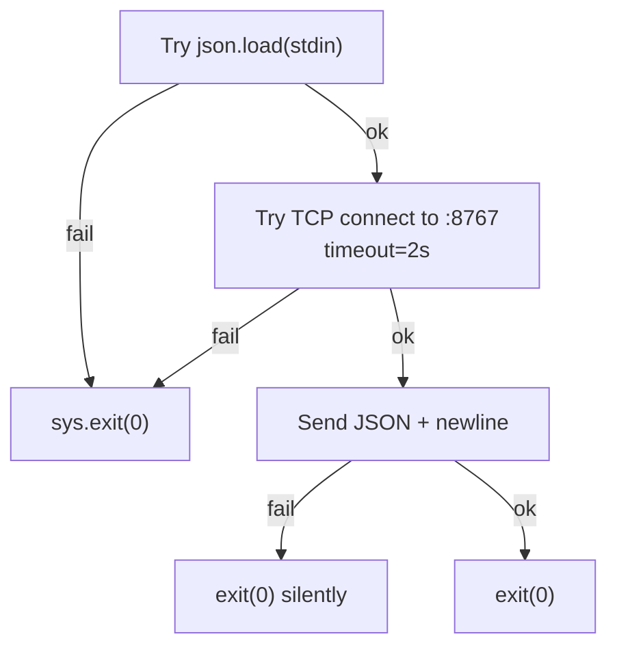
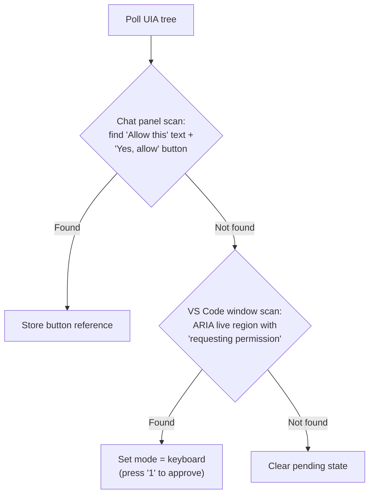
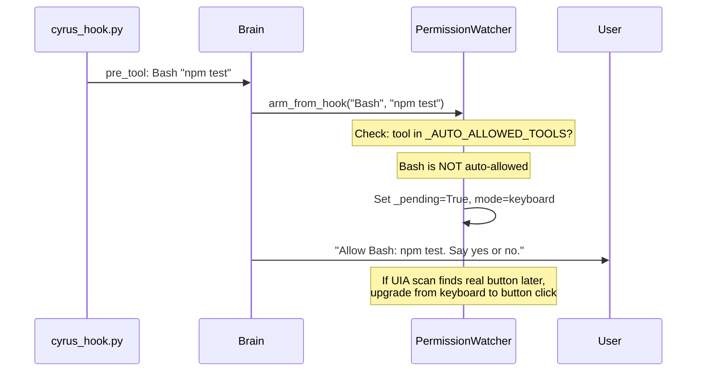
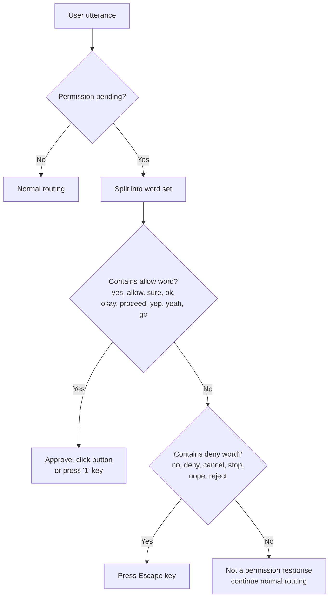

# 05 — Hooks and Permissions

## Hook Architecture

Claude Code supports lifecycle hooks -- scripts that run when specific events occur. Cyrus uses `cyrus_hook.py` to intercept five events and relay them to the brain.



## Hook Events

### Stop

Fires when Claude finishes responding. The hook extracts `last_assistant_message` and sends it to the brain, which cleans it for speech and reads it aloud.



### PreToolUse

Fires before Claude uses a tool. The hook sends the tool name and command to the brain.



The brain then:
1. Sends a `tool` message to voice/mobile for status display
2. Checks if the tool is auto-allowed (Read, Grep, Glob, Agent, etc.) -- if so, does nothing
3. Otherwise, arms the PermissionWatcher and speaks "Allow [tool]: [command]. Say yes or no."

### PostToolUse

Fires after a tool finishes. Only reports interesting results:
- **Bash with non-zero exit code:** "Command failed with exit code N."
- **Edit/Write/MultiEdit/NotebookEdit:** "Claude edited main.py." (always announced)
- Other tools: ignored.

### Notification

Fires on Claude Code system messages. The brain speaks the message with urgent priority.

### PreCompact

Fires before context compaction. The brain speaks "Memory compacting: [auto/manual]." and sends a status event to mobile clients.

## Hook Data Format

Hook receives JSON on stdin with these fields:

| Field | Present In | Description |
|-------|-----------|-------------|
| `hook_event_name` | All | "Stop", "PreToolUse", "PostToolUse", "Notification", "PreCompact" |
| `cwd` | All | Working directory of the Claude Code session |
| `last_assistant_message` | Stop | Claude's full response text |
| `tool_name` | PreToolUse, PostToolUse | "Bash", "Edit", "Write", etc. |
| `tool_input` | PreToolUse, PostToolUse | Dict with tool-specific fields |
| `tool_response` | PostToolUse | Dict with exit_code, stderr, etc. |
| `message` | Notification | Notification text |
| `trigger` | PreCompact | "auto" or "manual" |

## Hook Safety

The hook is designed to never block Claude Code:



Every error path exits 0. The brain being down means no voice feedback, but Claude Code continues unimpeded.

## PermissionWatcher

Each VS Code session gets a `PermissionWatcher` running on a daemon thread, polling every 0.3 seconds.

### Detection Methods



Two detection strategies:
1. **Chat panel button:** Walk the chat webview DOM, find `"Allow this"` TextControl followed by a `"Yes, allow"` ButtonControl. Click the button directly.
2. **VS Code Quick Pick:** Walk Chrome panes for `monaco-alert` with "requesting permission". Use keyboard shortcut `1` to select "1 Yes".

### Pre-Arming from Hooks

When a PreToolUse hook fires, the brain immediately arms the PermissionWatcher before the UIA dialog even appears:



Auto-allowed tools that never trigger permission: `Read, Grep, Glob, Agent, TodoWrite, TodoRead, AskFollowupQuestion, AskUserQuestion, Skill, ToolSearch, TaskOutput, TaskStop`.

### User Response Handling



### Input Prompt Detection

PermissionWatcher also detects open-ended input prompts (EditControls with a preceding label). When found:
1. Speak the label text as a question
2. User's next utterance is typed into the EditControl and submitted with Enter
3. Saying "cancel", "escape", "never mind" presses Escape instead

### Timeout Behavior

- **Split brain:** Permission pending state expires after 20 seconds if the UIA dialog disappears.
- **Split brain pre-arm:** If no dialog appears within 2 seconds of arming, pre-arm is cleared (tool was auto-allowed).
- **Monolith:** Permission clears when the button is no longer detected in UIA scan.

## Hook Configuration

Hooks are configured in `~/.claude/settings.json`:

```json
{
  "hooks": {
    "Stop": [{ "hooks": [{ "type": "command", "command": "/path/to/.venv/bin/python /path/to/cyrus_hook.py" }] }],
    "PreToolUse": [{ "hooks": [{ "type": "command", "command": "..." }] }],
    "PostToolUse": [{ "hooks": [{ "type": "command", "command": "..." }] }],
    "Notification": [{ "hooks": [{ "type": "command", "command": "..." }] }],
    "PreCompact": [{ "hooks": [{ "type": "command", "command": "..." }] }]
  }
}
```

The hook command must use the venv python so dependencies are available.
