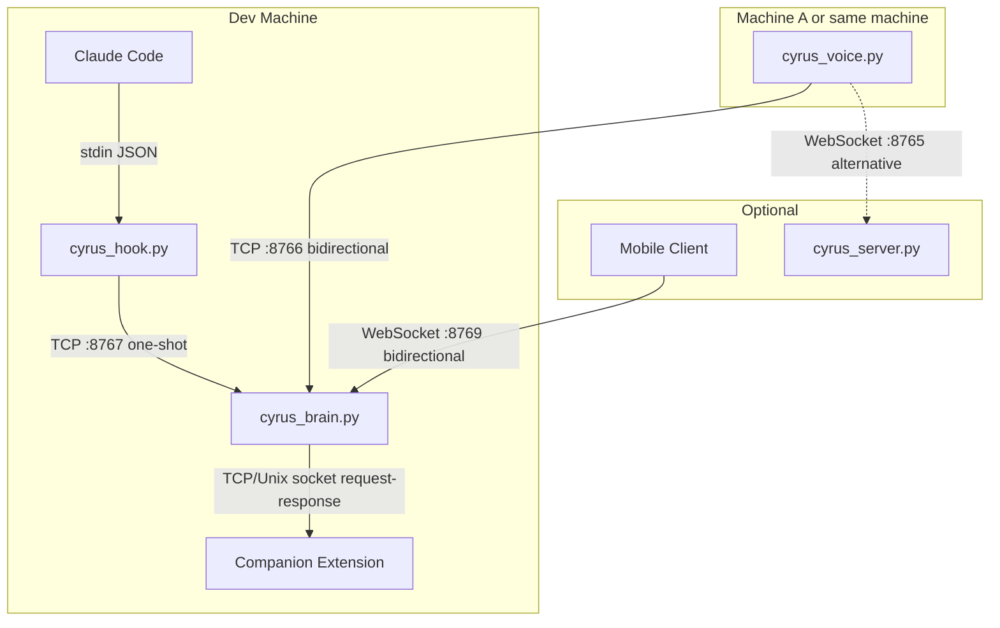
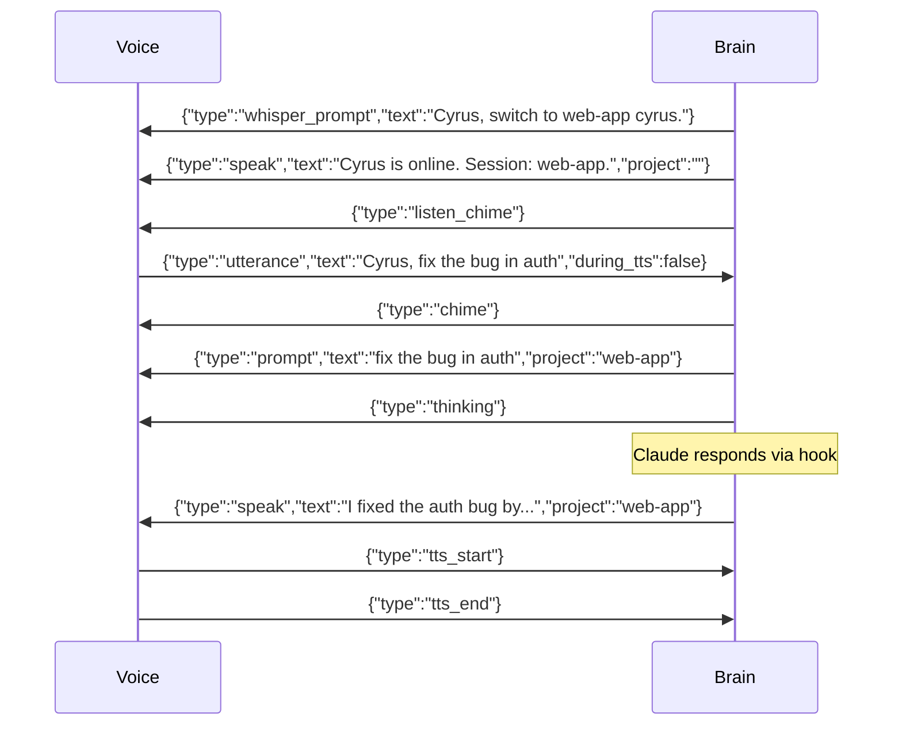
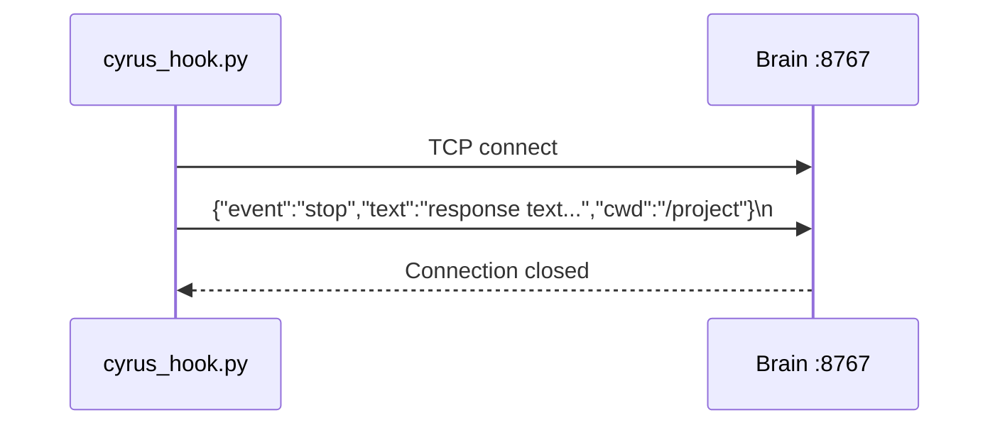
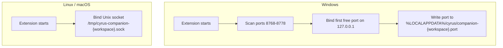

# 06 — Networking and Protocols

All Cyrus inter-process communication uses **line-delimited JSON** (one JSON object per line, terminated by `\n`).

## Network Topology



## Protocol: Voice <-> Brain (TCP :8766)

Persistent bidirectional TCP connection. Each message is `JSON\n`.

### Voice -> Brain

| Message | Fields | When Sent |
|---------|--------|-----------|
| `utterance` | `text`: string, `during_tts`: bool | After Whisper transcribes speech |
| `tts_start` | (none) | When TTS playback begins |
| `tts_end` | (none) | When TTS playback ends |

### Brain -> Voice

| Message | Key Fields | Purpose |
|---------|-----------|---------|
| `speak` | `text`, `project`, optional `full_text` | Queue text for TTS. `full_text` is the untruncated version sent to mobile clients. |
| `chime` | (none) | Play 880Hz notification chime |
| `listen_chime` | (none) | Play two-tone ascending beep (500Hz -> 800Hz) |
| `stop_speech` | (none) | Interrupt current TTS and drain queue |
| `pause` | (none) | Toggle pause state on voice side |
| `whisper_prompt` | `text` | Update Whisper's initial_prompt with project names |
| `status` | `msg` | Print status message |
| `tool` | `tool`, `command`, `project` | Announce tool usage (forwarded to mobile) |
| `prompt` | `text`, `project` | Announce user prompt submitted (forwarded to mobile) |
| `thinking` | (none) | Signal Claude is processing (forwarded to mobile) |

### Message Flow Example



## Protocol: Hook -> Brain (TCP :8767)

One-shot TCP connection per event. Hook connects, sends one JSON line, brain processes it, connection closes.



| Event | Key Fields | Trigger |
|-------|-----------|---------|
| `stop` | `text`, `cwd` | Claude finished responding |
| `pre_tool` | `tool`, `command`, `cwd` | Claude about to use a tool |
| `post_tool` | `tool`, `command`/`file_path`, `exit_code`, `error`, `cwd` | Tool finished |
| `notification` | `message`, `cwd` | Claude Code system message |
| `pre_compact` | `trigger`, `cwd` | Context compaction starting |

## Protocol: Brain <-> Companion Extension

Platform-specific transport, same JSON protocol.



### Request (Brain -> Extension)

```json
{"text": "fix the bug in auth.py\n\n[Voice mode: keep explanations to 2-3 sentences.]"}\n
```

### Response (Extension -> Brain)

```json
{"ok": true, "method": "enter-key-win32"}\n
```

Or on error:

```json
{"ok": false, "error": "Missing or empty text field"}\n
```

### Extension Submit Steps

1. `bringVscodeToFront()` -- Windows only, uses PowerShell SetForegroundWindow trick
2. `focusChatPanel()` -- tries `claude-vscode.focus`, `claude-vscode.sidebar.open`, `workbench.view.extension.claude-sidebar`
3. Write text to clipboard via VS Code API
4. Paste via `editor.action.clipboardPasteAction` (fallback: keyboard sim Ctrl+V)
5. Submit via Enter key (PowerShell SendKeys on Windows, osascript on macOS, xdotool on Linux)

## Protocol: Mobile <-> Brain (WebSocket :8769)

Experimental WebSocket endpoint for mobile clients.

### Mobile -> Brain

| Message | Fields | Purpose |
|---------|--------|---------|
| `utterance` | `text` | Transcribed speech from mobile |
| `ping` | (none) | Keep-alive |

### Brain -> Mobile

Brain broadcasts to all connected mobile clients. Only these message types are forwarded: `speak`, `prompt`, `thinking`, `tool`, `status`.

For `speak` messages, `full_text` is renamed to `text` so mobile clients get the untruncated response.

## Protocol: Remote Brain (WebSocket :8765)

Optional. `cyrus_server.py` is a stateless WebSocket server.

### Client -> Server

```json
{"type": "utterance", "text": "fix the bug", "project": "cyrus", "sessions": ["cyrus", "web app"], "last_response": "..."}\n
```

### Server -> Client

```json
{"type": "decision", "action": "forward", "message": "fix the bug\n\n[Voice mode: ...]", "spoken": "", "command": {}}\n
```

Actions: `forward` (send to Claude), `answer` (speak cached response), `command` (Cyrus meta-command).

## Connection Resilience

| Scenario | Behavior |
|----------|----------|
| Voice disconnects from brain | Brain preserves all state, voice auto-reconnects every 3s |
| Brain restarts | Voice reconnects, brain re-syncs whisper prompt and greeting |
| Hook can't reach brain | Silent failure, exit 0 |
| Companion extension not running | Brain falls back to UIA submit |
| Mobile client disconnects | Removed from broadcast set |
