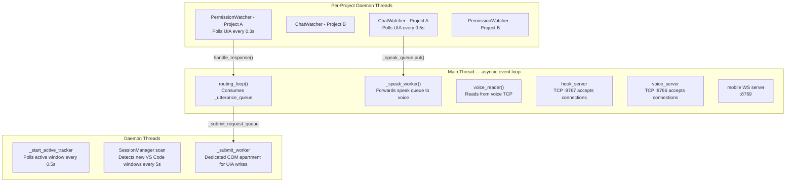
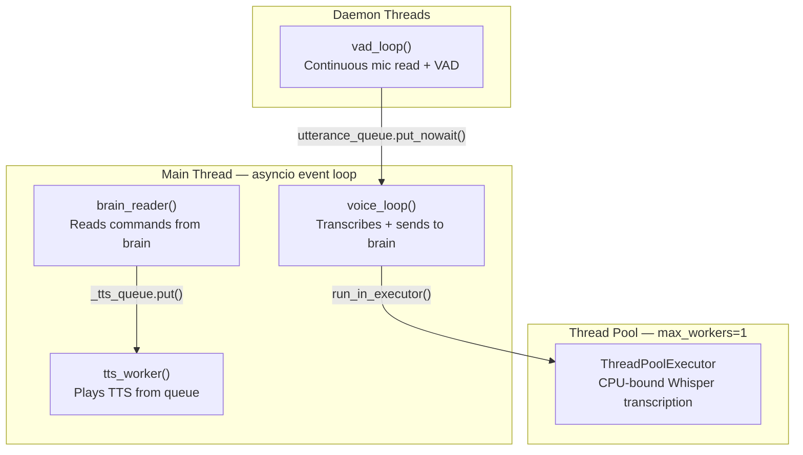
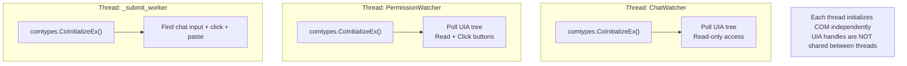

# 07 — Threading and Concurrency

Cyrus uses a mix of **asyncio coroutines** and **OS threads**. The rule: anything that blocks (audio I/O, UIA COM calls, CPU-bound Whisper) runs on a thread. Everything else is async.

## Brain Thread Model



## Voice Thread Model



## Monolith Thread Model

main.py combines both models. The main asyncio loop handles routing, TTS, and the utterance queue. Threads handle VAD, UIA polling, and window tracking.

## Why Threads + Async?

| Operation | Why it can't be async | Solution |
|-----------|----------------------|----------|
| VAD loop | `sd.RawInputStream.read()` blocks | Dedicated daemon thread |
| ChatWatcher | UIA COM calls block up to 2s | Dedicated daemon thread per project |
| PermissionWatcher | UIA COM calls block | Dedicated daemon thread per project |
| Submit to VS Code | UIA + pyautogui block | Dedicated daemon thread with COM init |
| Whisper transcription | CPU-bound, 1-3 seconds | `ThreadPoolExecutor(max_workers=1)` |
| Window focus tracking | `gw.getActiveWindow()` blocks | Dedicated daemon thread |
| Session scanning | `gw.getAllWindows()` blocks | Dedicated daemon thread |

## Synchronization Primitives

### threading.Event (cross-thread boolean signals)

| Event | Set When | Checked By |
|-------|----------|------------|
| `_mic_muted` | TTS playback starts | VAD loop -- skip audio frames |
| `_user_paused` | F9 pressed or pause command | VAD loop -- skip audio frames |
| `_stop_speech` | F7 pressed or stop command | TTS playback loop -- break early |
| `_tts_active` | TTS is currently playing | Main routing loop -- echo guard |
| `_tts_pending` | TTS is queued but not yet playing | Main routing loop -- echo guard |
| `_shutdown` | Ctrl+C | VAD loop -- exit while loop |

### asyncio.Queue (async data flow)

| Queue | Producer | Consumer | Items |
|-------|----------|----------|-------|
| `_speak_queue` (brain) | ChatWatcher threads, hook handler, routing | `_speak_worker()` | `(project, text)` or `(project, text, full_text)` |
| `_utterance_queue` (brain) | `voice_reader()`, mobile WS handler | `routing_loop()` | `(text, during_tts)` |
| `_tts_queue` (voice/monolith) | `brain_reader()` or routing loop | `tts_worker()` | `(project, text)` |
| `utterance_queue` (voice) | VAD loop via `put_nowait` | `voice_loop()` | `np.ndarray` audio |

### threading.Lock (shared mutable state)

| Lock | Protects |
|------|----------|
| `_active_project_lock` | `_active_project` string |
| `_project_locked_lock` | `_project_locked` boolean |
| `_voice_lock` (asyncio.Lock) | `_voice_writer` StreamWriter |

### stdlib queue.Queue (thread-to-thread)

| Queue | Purpose |
|-------|---------|
| `_submit_request_queue` | Main thread -> submit worker thread. Items: `(text, event, result_holder)` |

## COM Threading (Windows)

Windows UI Automation uses COM. COM objects are bound to the thread that created them and cannot be used across threads.



The split brain architecture solves this by having the submit worker cache plain integer pixel coordinates (`_chat_input_coords`) instead of COM objects. ChatWatcher populates these coords, and the submit worker uses them with `pyautogui.click()`.

## Stale Utterance Draining

Both architectures drain stale utterances from queues to stay responsive:

```python
# Keep only the most recent utterance
while not utterance_queue.empty():
    audio = utterance_queue.get_nowait()  # discard older
# Process only 'audio' (the latest)
```

This prevents falling behind if the user speaks multiple times while Cyrus is busy transcribing.
