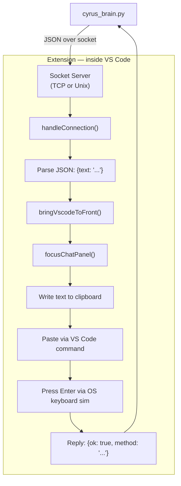
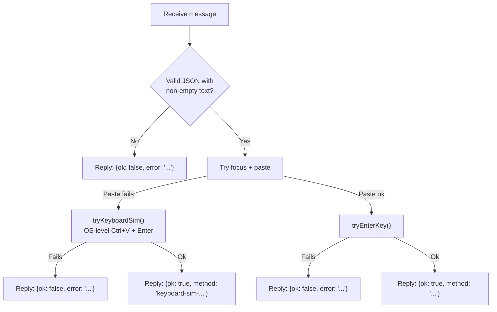

# 08 — Companion Extension

The Cyrus Companion is a VS Code extension that bridges the brain to the Claude Code chat panel. It lives in `cyrus-companion/`.

## Why an Extension?

External processes cannot reliably type into VS Code's webview-based UI. The extension runs **inside** VS Code with access to:
- VS Code commands API (focus panels, paste)
- Clipboard API
- Process execution (keyboard simulation)

## Architecture



## Platform-Specific Transport

```mermaid
flowchart TD
    ACTIVATE["Extension activates<br/>(onStartupFinished)"] --> PLATFORM{os.platform()}

    PLATFORM -->|win32| TCP["TCP server on 127.0.0.1"]
    TCP --> SCAN["Scan ports 8768-8778"]
    SCAN --> BIND["Bind first free port"]
    BIND --> WRITE["Write port number to<br/>%LOCALAPPDATA%/cyrus/companion-{workspace}.port"]

    PLATFORM -->|linux / darwin| UNIX["Unix socket server"]
    UNIX --> SOCK["/tmp/cyrus-companion-{workspace}.sock"]
```

The workspace name is sanitized: non-word characters become underscores, capped at 40 chars.

## Submit Pipeline Detail

### Step 1: Bring VS Code to Foreground (Windows only)

Windows blocks background processes from stealing focus. The extension uses a PowerShell script that:
1. Loads a C# class with `SetForegroundWindow` and `keybd_event` P/Invoke
2. Finds the VS Code process handle
3. Sends Alt key down/up (bypasses the focus restriction)
4. Calls `SetForegroundWindow` and `ShowWindow(SW_RESTORE)`

### Step 2: Focus Claude Code Chat Panel

Tries multiple VS Code command IDs in order:
1. `claude-vscode.focus` (Claude Code: Focus input)
2. `claude-vscode.sidebar.open` (Claude Code: Open in Side Bar)
3. `workbench.view.extension.claude-sidebar`

A user-configured command can be set via the `cyrusCompanion.focusCommand` setting, which takes priority.

### Step 3: Paste Text

Uses `editor.action.clipboardPasteAction` (VS Code's built-in paste command). If that fails, falls back to OS-level keyboard simulation (Ctrl+V / Cmd+V).

### Step 4: Press Enter

Platform-specific keyboard simulation:
- **Windows:** PowerShell `SendKeys('{ENTER}')`
- **macOS:** `osascript -e 'tell application "System Events" to key code 36'`
- **Linux:** `xdotool key Return`

## Configuration

| Setting | Type | Default | Description |
|---------|------|---------|-------------|
| `cyrusCompanion.focusCommand` | string | `""` | VS Code command ID to focus Claude Code panel. Empty = auto-detect. |

## Extension Manifest (package.json)

| Field | Value |
|-------|-------|
| `name` | `cyrus-companion` |
| `version` | `0.1.0` |
| `engines.vscode` | `^1.85.0` |
| `activationEvents` | `onStartupFinished` |
| `main` | `./out/extension.js` |

Zero runtime npm dependencies. Dev dependencies: `@types/node`, `@types/vscode`, `typescript`.

## Error Handling



The extension never throws unhandled exceptions. Socket errors from early client disconnects are silently caught.

## Cleanup

On deactivation or VS Code close:
- Server is closed
- Discovery file (Windows port file) or Unix socket file is deleted via `tryUnlink()`
