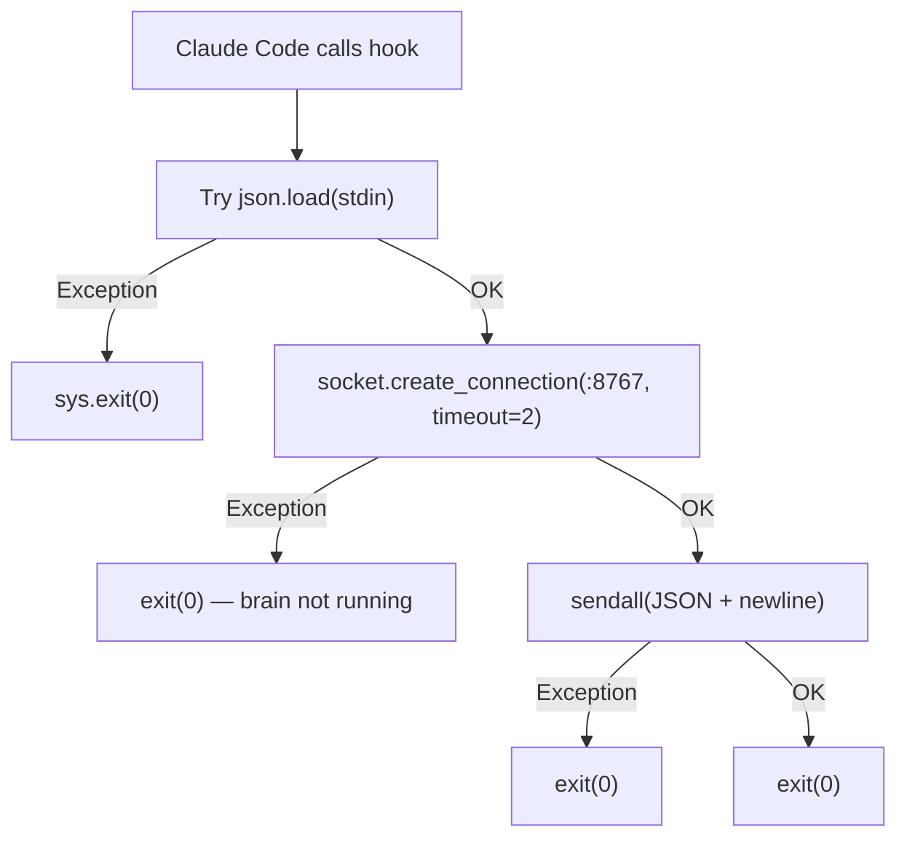

# 09 — Error Handling and Recovery

Cyrus is designed to degrade gracefully. Most failures are recoverable without user intervention.

## Recovery Strategies


## Hook Failure Isolation



Every path exits 0. A crashing hook would block Claude Code, so `cyrus_hook.py` wraps everything in try/except and never raises.

## Graceful Degradation Chain

```mermaid
flowchart TD
    subgraph "TTS Engine"
        KOKORO["Kokoro ONNX — local, fast"] -->|"Files missing or load fails"| EDGE["Edge TTS — cloud, slower"]
        EDGE -->|"Network down or ffmpeg missing"| NO_TTS["No TTS — text printed to console only"]
    end

    subgraph "GPU / Compute"
        CUDA["CUDA GPU — float16 Whisper"] -->|"No GPU detected"| CPU["CPU — int8 Whisper"]
        CUDA_TTS["CUDA Kokoro via ONNX"] -->|"No CUDA provider"| CPU_TTS["CPU Kokoro"]
    end

    subgraph "Submit Method"
        COMPANION["Companion Extension — IPC"] -->|"Not connected / error"| UIA_COORDS["UIA pixel coords — cached"]
        UIA_COORDS -->|"No cache"| UIA_SEARCH["UIA tree search — slow"]
        UIA_SEARCH -->|"Not found"| FAIL["Submit fails — logged"]
    end
```



## Whisper Hallucination Filter

Whisper hallucinates on silence/noise, producing YouTube training data artifacts:

```
"thank you for watching"
"see you in the next video"
"don't forget to like and subscribe"
"subtitles by"
"transcribed by"
```

The `_HALLUCINATIONS` regex catches these and discards them before they reach routing.

## RMS Energy Gate

Before sending audio to Whisper, an RMS energy check filters out near-silence:

```python
rms = float(np.sqrt(np.mean(audio ** 2)))
if rms < 0.004:  # ~-48 dBFS
    return ""
```

This prevents Whisper from hallucinating on quiet ambient noise that passed the VAD.

## Unicode Sanitization

TTS engines (especially Edge TTS) read raw Unicode bytes as gibberish. `_sanitize_for_speech()` converts:

| Unicode | Replacement |
|---------|-------------|
| Em dash (--) | `, ` |
| En dash (-) | `, ` |
| Ellipsis (...) | `...` |
| Curly quotes | Straight quotes |
| Bullet | `, ` |

Applied in both `clean_for_speech()` and `_send()` (brain sanitizes all outgoing text fields).

## Permission Timeout

| Scenario | Timeout | Result |
|----------|---------|--------|
| User doesn't respond to permission dialog | 20s (brain) | Pending state cleared, dialog stays open |
| Pre-arm with no UIA dialog appearing | 2s (brain) | Pre-arm cleared (tool was auto-allowed) |
| Monolith: dialog disappears from UIA | Next poll cycle | Pending state cleared |

## Common Issues

| Issue | Symptom | Auto-Recovery |
|-------|---------|---------------|
| Brain not running | Hook silently fails, no voice | Start brain, voice reconnects |
| Voice disconnects | Brain waits, no audio I/O | Voice reconnects every 3s |
| VS Code window closed | ChatWatcher can't find webview | Re-searches every 2s |
| Whisper hallucination | "Thanks for watching" | Regex filter discards |
| Audio too quiet | VAD triggers on noise | RMS gate < 0.004 discards |
| Unicode in response | TTS reads garbled bytes | `_sanitize_for_speech()` fixes |
| UIA tree structure changes | ChatWatcher extraction fails | Resets _chat_doc, re-searches |
| COM cache corrupted | UIAutomation import fails | Auto-clear comtypes.gen, retry |
| Companion extension not installed | IPC connection refused | Falls back to UIA submit |
| TTS playback stuck | Mic stays muted | 25s hard timeout aborts |
| Stale UIA button reference | Click() throws | Fall back to pyautogui.press("enter") |

## Force Exit

Both `main.py` and `cyrus_voice.py` use `os._exit(0)` on shutdown instead of normal Python exit. This bypasses C-extension destructor ordering issues that cause crashes when PortAudio/SDL threads are still live during Python teardown.
