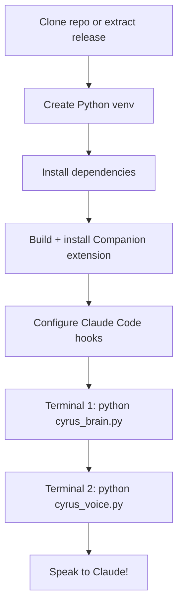
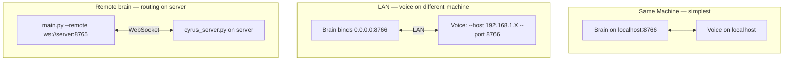

# 10 — Setup and Installation

## Quick Start



## Dependencies by Service

### Brain (cyrus_brain.py)

| Package | Purpose |
|---------|---------|
| `websockets` | Mobile WebSocket server |
| `comtypes` | COM support for UIAutomation (Windows) |
| `uiautomation` | Windows UI Automation API |
| `pyautogui` | Mouse click / keyboard simulation |
| `pygetwindow` | Window title scanning |
| `pyperclip` | Clipboard access |

### Voice (cyrus_voice.py)

| Package | Purpose |
|---------|---------|
| `faster-whisper` | Speech-to-text (medium.en model) |
| `torch` | PyTorch for Silero VAD |
| `silero-vad` | Voice activity detection |
| `sounddevice` | Microphone input + speaker output |
| `pygame-ce` | Chime sound generation |
| `keyboard` | Global hotkey registration |
| `edge-tts` | Fallback TTS (cloud) |
| `numpy` | Audio array processing |

### Monolith (main.py)

Needs all dependencies from both brain and voice, plus:
| Package | Purpose |
|---------|---------|
| `python-dotenv` | .env file loading |
| `websockets` | Optional remote brain connection |

### Companion Extension (cyrus-companion/)

| Requirement | Purpose |
|-------------|---------|
| Node.js + npm | Build toolchain |
| TypeScript 5.3+ | Compilation |
| VS Code 1.85+ | Runtime |

Zero runtime npm dependencies.

### Optional: Kokoro TTS

Place these files in the project root directory:
- `kokoro-v1.0.onnx` (~100 MB)
- `voices-v1.0.bin`

Also install:
| Package | Purpose |
|---------|---------|
| `kokoro-onnx` | Kokoro Python bindings |
| `onnxruntime` (or `onnxruntime-gpu`) | ONNX inference |

If these files are missing, Edge TTS is used automatically as fallback.

### System Dependencies

| Dependency | Required By | Notes |
|-----------|-------------|-------|
| `ffmpeg` | Edge TTS fallback | Must be on PATH. Decodes MP3 to PCM. |
| CUDA toolkit | GPU acceleration | Optional. Enables float16 Whisper + GPU Kokoro. |

## Models (auto-downloaded)

| Model | Size | Downloaded By |
|-------|------|---------------|
| Whisper medium.en | ~769 MB | `faster-whisper` on first use |
| Silero VAD | ~1 MB | `silero-vad` on first use |

## Developer Setup

```bash
# Clone
git clone <repo-url>
cd cyrus

# Python environment
python -m venv .venv
source .venv/bin/activate        # Linux/macOS
# .venv\Scripts\activate         # Windows
pip install -r requirements.txt

# Build companion extension
cd cyrus-companion
npm install
npm run compile
# Install into VS Code:
# code --install-extension cyrus-companion-0.1.0.vsix

# Configure hooks in ~/.claude/settings.json
# (see doc 05-hooks-and-permissions.md)

# Run split services
python cyrus_brain.py            # Terminal 1
python cyrus_voice.py            # Terminal 2

# Or run monolith
python main.py
```

## Network Setup Scenarios



## Hook Configuration

Add to `~/.claude/settings.json`:

```json
{
  "hooks": {
    "Stop": [{ "hooks": [{ "type": "command", "command": "/path/to/.venv/bin/python /path/to/cyrus_hook.py" }] }],
    "PreToolUse": [{ "hooks": [{ "type": "command", "command": "/path/to/.venv/bin/python /path/to/cyrus_hook.py" }] }],
    "PostToolUse": [{ "hooks": [{ "type": "command", "command": "/path/to/.venv/bin/python /path/to/cyrus_hook.py" }] }],
    "Notification": [{ "hooks": [{ "type": "command", "command": "/path/to/.venv/bin/python /path/to/cyrus_hook.py" }] }],
    "PreCompact": [{ "hooks": [{ "type": "command", "command": "/path/to/.venv/bin/python /path/to/cyrus_hook.py" }] }]
  }
}
```

Use the venv Python path so the hook has access to dependencies.

## Installer Scripts

| File | Platform | Purpose |
|------|----------|---------|
| `install-brain.sh` | Linux/macOS | Venv, deps, hooks, extension build+install |
| `install-brain.ps1` | Windows | Same as above |
| `install-brain.bat` | Windows | Wrapper to bypass execution policy |
| `install-voice.sh` | Linux/macOS | Venv, deps, PyTorch, start script |
| `install-voice.ps1` | Windows | Same as above |
| `install-voice.bat` | Windows | Wrapper to bypass execution policy |
| `build-release.ps1` | Windows | Package into release zips |
