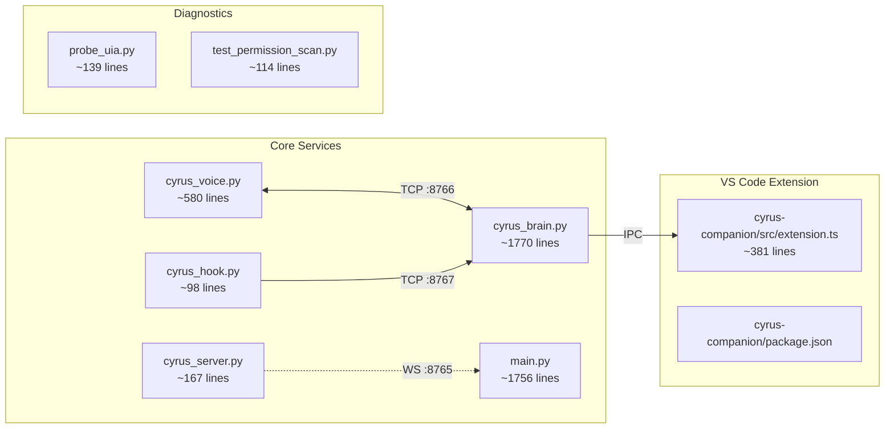

# 11 — File Reference

## File Map

---

## cyrus_voice.py — Voice I/O Service

Audio capture, speech recognition, and TTS playback. Connects to brain over TCP.

### Key Functions

| Function | Description |
|----------|-------------|
| `main()` | Entry point. Loads models, registers hotkeys, connects to brain, starts VAD. |
| `vad_loop(on_utterance, loop)` | Daemon thread. Reads mic, runs Silero VAD, emits audio chunks when speech detected. |
| `transcribe(whisper_model, audio)` | Runs Whisper on audio array. Filters hallucinations, checks RMS energy. |
| `voice_loop(whisper_model, reader, writer, loop)` | Main async loop. Transcribes utterances, sends to brain, manages TTS. |
| `brain_reader(reader)` | Reads JSON commands from brain TCP stream. Dispatches speak/chime/stop/pause. |
| `tts_worker()` | Serial TTS consumer. Plays one item at a time from `_tts_queue`. |
| `speak(text)` | Mutes mic, calls Kokoro or Edge TTS, unmutes with 250ms guard. |
| `_speak_kokoro(text)` | Local Kokoro ONNX TTS. Generates samples, plays via sounddevice. |
| `_speak_edge(text)` | Edge TTS fallback. Downloads MP3, decodes with ffmpeg, plays PCM. |
| `drain_tts_queue()` | Empties TTS queue (used when stopping speech). |
| `play_chime()` | 880Hz notification tone via pygame. |
| `play_listen_chime()` | Two-tone ascending beep (500Hz -> 800Hz). |
| `_strip_fillers(text)` | Removes leading filler words (uh, um, okay, etc.) |

### Key State

| Variable | Type | Purpose |
|----------|------|---------|
| `_mic_muted` | `threading.Event` | Set during TTS to prevent echo |
| `_user_paused` | `threading.Event` | Set by F9 / pause command |
| `_stop_speech` | `threading.Event` | Set by F7 / stop command |
| `_tts_active` | `threading.Event` | Set while audio is playing |
| `_tts_pending` | `threading.Event` | Set when TTS is queued |
| `_shutdown` | `threading.Event` | Set on Ctrl+C |
| `_kokoro` | `Kokoro | None` | Kokoro TTS engine instance |
| `_brain_writer` | `StreamWriter | None` | TCP writer to brain |
| `_tts_queue` | `asyncio.Queue` | `(project, text)` pairs from brain |
| `_whisper_prompt` | `str` | Current Whisper initial_prompt |

### Configuration Constants

| Constant | Value | Description |
|----------|-------|-------------|
| `WHISPER_MODEL` | `"medium.en"` | Whisper model size |
| `BRAIN_HOST` / `BRAIN_PORT` | `localhost` / `8766` | Default brain address |
| `TTS_VOICE` | `"af_heart"` | Kokoro voice name |
| `TTS_SPEED` | `1.0` | Kokoro speed multiplier |
| `SAMPLE_RATE` | `16000` | Audio sample rate (Hz) |
| `FRAME_SIZE` | `512` | Samples per VAD frame |
| `SPEECH_THRESHOLD` | `0.5` | VAD probability cutoff |
| `MAX_RECORD_MS` | `12000` | Max recording duration |

---

## cyrus_brain.py — Brain / Logic Service

Routing, session management, UIA automation, hook handling. No audio hardware dependency.

### Key Classes

#### `ChatWatcher`

Polls a Claude Code chat webview via UIA. Detects new responses and enqueues them for TTS.

| Method | Description |
|--------|-------------|
| `start(loop, is_active_fn)` | Spawns polling daemon thread. |
| `_find_webview()` | Navigates UIA tree: VS Code window -> Chrome pane -> DocumentControl. |
| `_walk(ctrl, depth, max_depth)` | Recursively walks UIA tree, collecting (depth, type, name) tuples. |
| `_extract_response(results)` | Finds Claude's latest response between "Thinking" button and "Message input" edit. |
| `flush_pending(loop)` | Speaks all queued responses for this session. |

| Property | Description |
|----------|-------------|
| `POLL_SECS` | `0.5` — polling interval |
| `STABLE_SECS` | `1.2` — response must be unchanged this long before speaking |

#### `PermissionWatcher`

Polls for permission dialogs and input prompts.

| Method | Description |
|--------|-------------|
| `start(loop)` | Spawns polling daemon thread. |
| `arm_from_hook(tool, cmd, loop)` | Pre-arms from PreToolUse hook. Skips auto-allowed tools. |
| `_scan()` | Walks chat doc once. Returns `(perm_btn, cmd, prompt_ctrl, prompt_label)`. |
| `_scan_window_for_permission()` | Scans Chrome panes for ARIA live region "requesting permission". |
| `handle_response(text)` | Processes yes/no voice response. Clicks button or presses key. |
| `handle_prompt_response(text)` | Types text into prompt input or presses Escape on cancel. |

| Property | Description |
|----------|-------------|
| `POLL_SECS` | `0.3` — polling interval |
| `ALLOW_WORDS` | `{yes, allow, sure, ok, okay, proceed, yep, yeah, go}` |
| `DENY_WORDS` | `{no, deny, cancel, stop, nope, reject}` |
| `_AUTO_ALLOWED_TOOLS` | `{Read, Grep, Glob, Agent, TodoWrite, ...}` — never need permission |

#### `SessionManager`

Manages per-project ChatWatcher and PermissionWatcher instances.

| Method | Description |
|--------|-------------|
| `start(loop)` | Initial scan + spawns background scanner thread (every 5s). |
| `on_session_switch(proj, loop)` | Flushes pending responses for switched-to project. |
| `last_response(proj)` | Returns last spoken response for a project. |
| `rename_alias(old, new, proj)` | Replaces a session alias. |

### Key Functions

| Function | Description |
|----------|-------------|
| `main()` | Entry point. Starts servers, session manager, routing loop. |
| `routing_loop(session_mgr, loop)` | Async loop consuming utterances. Handles echo guard, permissions, wake word, routing. |
| `voice_reader(reader, session_mgr, loop)` | Reads utterances + TTS events from voice TCP. |
| `handle_hook_connection(reader, writer, session_mgr)` | Processes one hook event: stop, pre_tool, post_tool, notification, pre_compact. |
| `handle_mobile_ws(ws)` | WebSocket handler for mobile clients. |
| `handle_voice_connection(reader, writer, session_mgr, loop)` | Handles voice TCP connection lifecycle. Sends greeting + whisper prompt. |
| `_fast_command(text)` | Regex router for Cyrus meta-commands. |
| `_execute_cyrus_command(ctype, cmd, spoken, session_mgr, loop)` | Executes switch/unlock/which/last/rename/pause commands. |
| `submit_to_vscode(text)` | Thread-safe submit dispatcher. |
| `_submit_to_vscode_impl(text)` | Actual submit: tries extension first, falls back to UIA. |
| `_submit_via_extension(text)` | IPC submit via Companion extension. |
| `clean_for_speech(text)` | Strips markdown, truncates, sanitizes Unicode. |
| `_resolve_project(query, aliases)` | Fuzzy-matches project name query against known aliases. |

### Key State

| Variable | Type | Purpose |
|----------|------|---------|
| `_active_project` | `str` | Currently focused project name |
| `_project_locked` | `bool` | True = ignore window focus changes |
| `_conversation_active` | `bool` | True = no wake word needed for next utterance |
| `_tts_active_remote` | `bool` | True while voice is playing TTS |
| `_speak_queue` | `asyncio.Queue` | `(project, text[, full_text])` -> sent to voice |
| `_utterance_queue` | `asyncio.Queue` | `(text, during_tts)` from voice/mobile |
| `_voice_writer` | `StreamWriter | None` | TCP writer to voice service |
| `_mobile_clients` | `set` | Active WebSocket connections |
| `_chat_input_coords` | `dict` | `proj -> (cx, cy)` pixel coords for click-based submit |
| `_submit_request_queue` | `queue.Queue` | Thread-safe submit dispatch |

### Ports

| Port | Purpose |
|------|---------|
| 8766 | Voice TCP (bidirectional) |
| 8767 | Hook TCP (one-shot per event) |
| 8769 | Mobile WebSocket |

---

## cyrus_hook.py — Claude Code Hook Script

Minimal script called by Claude Code for lifecycle events. Reads JSON from stdin, sends to brain on TCP :8767. Always exits 0.

| Function | Description |
|----------|-------------|
| `main()` | Parse stdin JSON, dispatch on `hook_event_name`, send to brain. |
| `_send(msg)` | TCP connect to brain, send JSON line, close. Silent on failure. |

Handles: `Stop`, `PreToolUse`, `PostToolUse`, `Notification`, `PreCompact`.

---

## cyrus_server.py — Remote Brain (WebSocket)

Stateless WebSocket server for routing decisions. Used with `main.py --remote ws://host:8765`.

| Function | Description |
|----------|-------------|
| `main()` | Parse args, start WebSocket server. |
| `handle_client(websocket)` | Process utterances: fast_command -> answer request -> forward. |
| `_fast_command(text)` | Same regex router as brain/monolith. |
| `_is_answer_request(text)` | Detect replay/summarize requests. |

---

## main.py — Monolith

Everything in one process: voice I/O, routing, UIA automation, session management.

Combines the functionality of `cyrus_voice.py` and `cyrus_brain.py`. Has additional support for `--remote` WebSocket brain and `_remote_route()` for server-side routing.

Key difference from split: no TCP between voice and brain; queues are in-process. Submit uses UIA directly (no dedicated thread in the current monolith).

---

## probe_uia.py — UIA Diagnostic Tool

Walks VS Code's accessibility tree to debug chat webview detection.

| Function | Description |
|----------|-------------|
| `main()` | Two strategies: Chrome render widget -> DocumentControls, and built-in search. |
| `walk_deep(control, depth, max_depth)` | Recursively walks UIA tree, collecting text content. |
| `print_results(results, label)` | Formats and prints discovered elements. |

---

## test_permission_scan.py — Permission Dialog Diagnostic

Continuously scans VS Code UIA tree for permission dialogs. Run while triggering a permission prompt.

| Function | Description |
|----------|-------------|
| `main()` | Shallow walk of VS Code + deep walk of Chrome panes. Marks "Allow this" and "Yes" elements. |
| `walk_and_print(ctrl, d, max_depth)` | Recursive UIA tree printer with markers for permission-related elements. |
| `scan_chrome_panes(vscode)` | Collects all `Chrome_RenderWidgetHostHWND` panes. |

Runs in an infinite loop, scanning every 3 seconds.

---

## cyrus-companion/src/extension.ts — VS Code Extension

Platform-adaptive IPC server inside VS Code.

| Function | Description |
|----------|-------------|
| `activate(context)` | Start IPC server, register cleanup. |
| `deactivate()` | Close server, delete discovery file/socket. |
| `startServer(safe)` | Platform dispatch: TCP (Windows) or Unix socket. |
| `startTcp(srv, safe)` | Scan ports 8768-8778, write discovery file. |
| `startUnixSocket(srv, safe)` | Bind to `/tmp/cyrus-companion-{safe}.sock`. |
| `handleConnection(socket)` | Parse JSON, call `submitText()`, reply. |
| `submitText(text)` | Full pipeline: foreground, focus, paste, enter. |
| `bringVscodeToFront()` | Windows PowerShell SetForegroundWindow trick. |
| `focusChatPanel()` | Try multiple VS Code command IDs. |
| `tryEnterKey()` | Platform keyboard sim for Enter. |
| `tryKeyboardSim()` | Platform keyboard sim for Ctrl+V + Enter. |

## cyrus-companion/package.json

| Field | Value |
|-------|-------|
| `activationEvents` | `["onStartupFinished"]` |
| `contributes.configuration` | `cyrusCompanion.focusCommand` setting |
| `devDependencies` | `@types/node`, `@types/vscode`, `typescript` |
